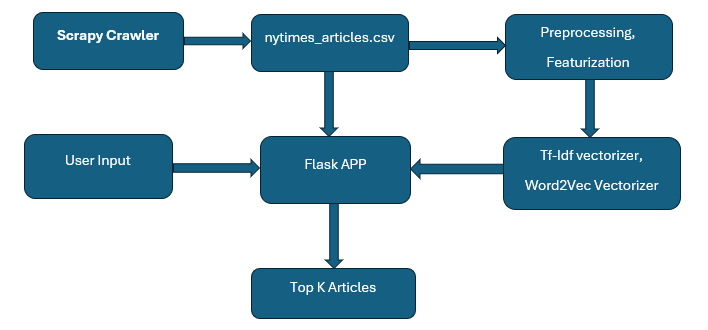

## Abstract
The project aims to develop a news article search and recommendation system using natural language processing techniques. Headlines and articles are crawled from The New York Times website using a Scrapy-based crawler. The crawled data is preprocessed, including tokenization, stopword removal, and stemming. Feature engineering is performed using two methods: TF-IDF and Word2Vec implemented with Gensim. The resulting TF-IDF matrix and Word2Vec embeddings are saved for later use. A Flask-based web application is developed to provide a user interface for querying similar articles. The system's objective is to efficiently retrieve and recommend news articles based on user queries.

## Overview
The project involves several important parts working together to make a reliable and effective news article search and recommendation system. First, there's a smart web crawler made with Scrapy. It's like a robot that goes to The New York Times website and collects both short headlines and full articles. After that, there's a careful process to clean up the collected data. We use techniques like splitting the text into smaller parts, removing unimportant words, and simplifying words to make it easier to understand. Then, we focus on finding important words and phrases from the text using methods called TF-IDF and Word2Vec. These fancy terms help us figure out which articles are similar to each other. We use a library called Gensim to help us do this. We end up with some special files that hold all this important information. Finally, there's a special website made with Flask where people can type in what they're looking for, and our system finds and shows them articles they might like based on what they typed.

## Design
The design of the news article search and recommendation system is meticulously crafted to ensure its effectiveness, efficiency, and scalability. It encompasses several key components, each playing a crucial role in the overall functioning of the system:
Web Crawler:
The web crawler is the foundational component of the system, responsible for systematically collecting data from The New York Times website.
Engineered using Scrapy, a powerful web crawling and scraping framework, the crawler navigates through the website's pages to gather both headline snippets and complete articles.
It adheres to ethical scraping practices and respects the website's robots.txt file to ensure legal and ethical data collection.
Preprocessing Pipeline:
Following data acquisition, the collected text undergoes a meticulous preprocessing pipeline to enhance its quality and prepare it for further analysis.
Techniques such as tokenization, where text is divided into smaller units like words or phrases, are applied to break down the text into manageable components.
Stopword elimination involves removing common words (e.g., "the", "is", "and") that do not carry significant meaning, thereby reducing noise in the data.
Stemming, a process of reducing words to their root form (e.g., "running" to "run"), helps in standardizing text representations and improving analysis accuracy.
Feature Engineering:
Feature engineering is a critical phase where meaningful features are extracted from the preprocessed text data to facilitate effective similarity calculations.
Two distinct methodologies, TF-IDF and Word2Vec, are employed to capture different aspects of the textual information.
TF-IDF (Term Frequency-Inverse Document Frequency) assigns weights to words based on their frequency in a document relative to their frequency across all documents, highlighting important terms.
Word2Vec utilizes neural network-based models to learn distributed representations of words in a continuous vector space, capturing semantic relationships between words.
These feature extraction techniques are implemented using the Gensim library, known for its robustness and efficiency in handling large text datasets.
Flask Application:
The Flask application serves as the interactive interface through which users interact with the system.
It provides a user-friendly platform where users can input their queries and receive relevant news article recommendations.
The application is designed to be intuitive and responsive, with a clean and visually appealing user interface.
Behind the scenes, the application leverages the precomputed features (TF-IDF matrices and Word2Vec embeddings) to calculate similarity scores and retrieve top-k recommendations based on user input.
Overall, the design of the news article search and recommendation system prioritizes efficiency, accuracy, and user experience. By carefully orchestrating the integration of various components and leveraging advanced techniques in data processing and analysis, the system aims to deliver timely and personalized news article recommendations to its users.

## Architecture
The architecture of the news article search and recommendation system is designed to facilitate the seamless integration and interaction of its core components: the web crawler, preprocessing module, feature engineering module, Flask application, and storage.
The web crawler, built using Scrapy, acts as the data acquisition engine, systematically traversing The New York Times website to gather headline snippets and complete articles. It adheres to ethical scraping practices to ensure responsible data collection.
Once the data is collected, it flows into the preprocessing module, where it undergoes a series of transformations to enhance its quality and prepare it for analysis. Techniques such as tokenization, stopword elimination, and stemming are applied to standardize and refine the text data.
The feature engineering module extracts meaningful features from the preprocessed text using TF-IDF and Word2Vec methodologies implemented with the Gensim library. This phase generates TF-IDF matrices and Word2Vec embeddings, which serve as the basis for similarity calculations.
The resulting TF-IDF matrices and Word2Vec embeddings, along with the original data, are stored in the storage component. This component includes:
nytimes_articles.csv: The CSV file containing the raw data collected by the web crawler.
tfidf_vectorizer.pkl: The pickle file storing the TF-IDF vectorizer used for feature extraction.
embeddings_wordvec.pkl: The pickle file containing the Word2Vec embeddings generated by the feature engineering module.
Finally, the Flask application provides the user interface for querying similar articles. It leverages the precomputed features to calculate similarity scores and retrieve top-k recommendations based on user input.

## Architecture Diagram

The diagram illustrates the flow of data and interaction between the various components of the system. The web crawler collects data from The New York Times website and passes it to the preprocessing module, where text data undergoes cleaning and standardization. The preprocessed data is then fed into the feature engineering module, which generates TF-IDF matrices and Word2Vec embeddings. These features, along with the original data and storage components, are utilized by the Flask application to provide users with personalized article recommendations based on their queries.

## Operation
The operation of the news article search and recommendation system encompasses various aspects, including software commands, user inputs, and installation procedures.
Software Commands:
The system is primarily driven by user interactions through the Flask-based web application. However, there are certain commands and procedures involved in the operation of individual components:
Web Crawler:
The web crawler operates autonomously once initiated, systematically collecting data from The New York Times website. It does not require manual intervention or commands during its execution.
Preprocessing Module:
The preprocessing module is typically executed as part of the data processing pipeline after data collection by the web crawler. However, if needed, specific commands or scripts may be run to initiate preprocessing tasks.
Feature Engineering Module:
Similarly, the feature engineering module performs its tasks automatically as part of the data processing pipeline. Users may interact with scripts or commands to execute feature extraction tasks if necessary.
Flask Application:
The Flask application is launched using standard commands for running Python web applications. Users typically start the Flask server using commands like flask run or python app.py from the command line.
Inputs:
Users interact with the system primarily through the Flask-based web application, providing inputs via the user interface:
Query Text Field:
Users input their query, typically a search term or phrase, into a text field provided by the Flask application. This query is used to find similar news articles.
K Integer Field:
Users specify the number of similar results they want to retrieve by entering an integer value in the designated field. This parameter determines the number of top-k recommendations returned by the system.
Submit Button (Search):
Upon entering the query and specifying the value of K, users initiate the search process by clicking the submit button labeled "Search". This triggers the system to retrieve and display the top-k similar articles.
Installation:
To set up and run the news article search and recommendation system, follow these installation procedures:
Clone Repository:
Begin by cloning the project repository from the designated source, ensuring access to the latest version of the codebase.
Install Dependencies:
Navigate to the project directory and install the required dependencies using a package manager like pip. Run pip install -r requirements.txt to install all necessary libraries and packages.
Run Web Crawler:
Execute the web crawler script to initiate data collection from The New York Times website. Ensure proper configuration and permissions are set before running the crawler.
To run Scrapy crawler crapy runspider nytimes_spider.py -o nytimes_articles.csv to save the result in 
Preprocess Data:
Run the preprocessing scripts to clean and prepare the collected data for feature extraction. Verify that the preprocessing tasks are completed successfully before proceeding.
Run Feature Engineering:
Execute the feature engineering scripts to generate TF-IDF matrices and Word2Vec embeddings from the preprocessed text data. Confirm that the feature extraction process is executed without errors.
Launch Flask Application:
Start the Flask server by running the application script (app.py or equivalent) using the appropriate command (flask run or python app.py). Access the application via the provided URL to interact with the system through the user interface.
In this python app_word2vec.py for word2vec embeddings and app_tfidf.py  for TF-IDF embeddings.
By following these installation procedures and executing the necessary commands, users can successfully deploy and operate the news article search and recommendation system.

## Conclusion
The implementation of both TF-IDF and Word2Vec methodologies within the news article search and recommendation system has provided valuable insights into their respective strengths and limitations.
Success/Failure Results:
Utilizing TF-IDF vectorization has demonstrated notable success in terms of system performance, with quicker app loading times and faster response rates. This efficiency in operation translates to enhanced user experience and responsiveness.
Conversely, employing Word2Vec embeddings has introduced challenges in system performance, particularly in the loading time of the Word2Vec model from the Gensim library. This has resulted in slower app loading and response times compared to TF-IDF vectorization.
Outputs:
Despite the differences in performance, both TF-IDF and Word2Vec implementations have yielded improvements in the quality of search results and article recommendations.
TF-IDF-based similarity calculations have provided reliable and relevant recommendations, albeit with faster processing times.
Word2Vec embeddings have enhanced the system's capability to capture semantic relationships between words and phrases, leading to more nuanced and contextually accurate recommendations.
Caveats/Cautions:
It is important to acknowledge the trade-offs between efficiency and effectiveness when choosing between TF-IDF and Word2Vec methodologies. While TF-IDF offers faster processing times, Word2Vec provides richer semantic representations at the cost of increased computational overhead.
Users should be informed about the potential delay in app loading and response times associated with Word2Vec implementation, allowing for appropriate expectations and understanding of system behavior.
Continuous optimization and refinement of system architecture and implementation strategies may mitigate some of the performance challenges encountered, ensuring a balance between responsiveness and accuracy in recommendation outcomes.
In conclusion, the adoption of both TF-IDF and Word2Vec methodologies enriches the news article search and recommendation system, offering users a spectrum of options tailored to their preferences and requirements. While TF-IDF excels in efficiency, Word2Vec introduces depth and contextuality, contributing to a more comprehensive and nuanced user experience. By considering the trade-offs and leveraging the strengths of each approach, the system aims to deliver personalized and relevant news article recommendations to its users.
Data Sources
The data source for this project is The New York Times website. Data is collected using a Scrapy-based web crawler. Access to the website is publicly available.
Test Cases
Test cases are implemented using the PyTest framework to ensure functionality and reliability. Test coverage includes unit tests for individual components and integration tests for end-to-end functionality.
Source Code
The source code for the project is available in a GitHub repository. It includes Python scripts for the web crawler, preprocessing, feature engineering, Flask application, and associated documentation. Dependencies are managed using a requirements.txt file and include open-source libraries such as Scrapy, Gensim, and Flask.
Bibliography
Reference citations follow the Chicago style (AMS/AIP or ACM/IEEE). Key references include documentation and official websites of libraries and frameworks used in the project, academic papers on TF-IDF and Word2Vec methodologies, and relevant articles on web scraping and natural language processing.

## References :
https://www.researchgate.net/publication/326425709_Text_Mining_Use_of_TF-IDF_to_Examine_the_Relevance_of_Words_to_Documents
https://www.researchgate.net/publication/336203802_Word2Vec_Model_Analysis_for_Semantic_Similarities_in_English_Words
https://www.geeksforgeeks.org/cosine-similarity/
https://docs.scrapy.org/en/latest/topics/spiders.html

